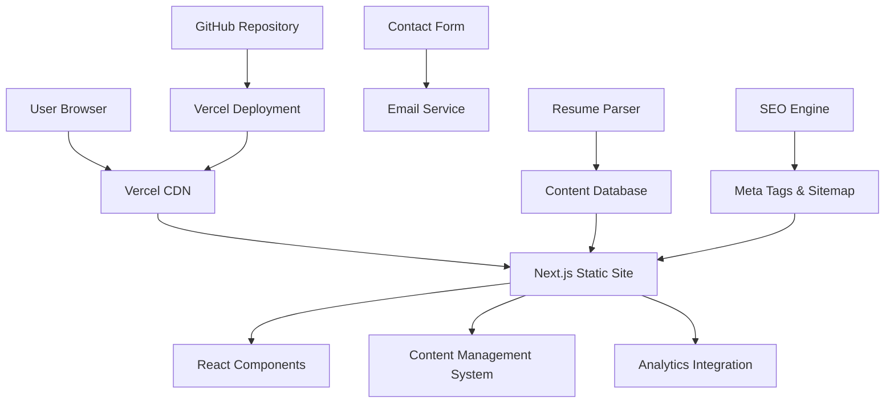

# Design Document: Customer Success Manager Profile Website
# 设计文档：客户成功经理个人作品集网站

## Overview
## 概述

The Customer Success Manager Profile Website is a modern, responsive web application built using Next.js and React. The website showcases professional achievements, integrates resume content, and provides networking capabilities while being deployed on free hosting platforms. The architecture emphasizes performance, SEO optimization, and ease of content management.

<!-- 客户成功经理个人作品集网站是使用Next.js和React构建的现代响应式Web应用程序。该网站展示专业成就，集成简历内容，并提供网络功能，同时部署在免费托管平台上。架构强调性能、SEO优化和内容管理的便利性。 -->

The solution leverages static site generation (SSG) for optimal performance and SEO, with dynamic content management capabilities for easy updates. The website will be deployed using Vercel's free tier, providing automatic deployments, HTTPS, and global CDN distribution.

<!-- 该解决方案利用静态站点生成（SSG）来获得最佳性能和SEO，具有动态内容管理功能以便于更新。网站将使用Vercel的免费层部署，提供自动部署、HTTPS和全球CDN分发。 -->

## Architecture
## 架构

### High-Level Architecture
### 高级架构



### Technology Stack
### 技术栈

**Frontend Framework**: Next.js 14 with React 18
<!-- 前端框架：Next.js 14 与 React 18 -->
- Static Site Generation (SSG) for optimal performance
  <!-- 静态站点生成（SSG）以获得最佳性能 -->
- Built-in SEO optimization features
  <!-- 内置SEO优化功能 -->
- Automatic code splitting and optimization
  <!-- 自动代码分割和优化 -->
- TypeScript for type safety
  <!-- TypeScript确保类型安全 -->

**Styling**: Tailwind CSS
<!-- 样式：Tailwind CSS -->
- Utility-first CSS framework
  <!-- 实用程序优先的CSS框架 -->
- Built-in responsive design utilities
  <!-- 内置响应式设计工具 -->
- Dark mode support
  <!-- 深色模式支持 -->
- Customizable design system
  <!-- 可定制的设计系统 -->

**Deployment**: Vercel Free Tier
<!-- 部署：Vercel免费层 -->
- Automatic deployments from GitHub
  <!-- 从GitHub自动部署 -->
- Global CDN distribution
  <!-- 全球CDN分发 -->
- Free SSL certificates
  <!-- 免费SSL证书 -->
- Custom domain support
  <!-- 自定义域名支持 -->

**Content Management**: File-based CMS with JSON/Markdown
<!-- 内容管理：基于文件的CMS，支持JSON/Markdown -->
- Version-controlled content
  <!-- 版本控制的内容 -->
- Easy editing through GitHub interface
  <!-- 通过GitHub界面轻松编辑 -->
- Automatic regeneration on content updates
  <!-- 内容更新时自动重新生成 -->

**Analytics**: Google Analytics 4 (Free)
<!-- 分析：Google Analytics 4（免费） -->
- Privacy-compliant tracking
  <!-- 符合隐私规定的跟踪 -->
- Professional insights and reporting
  <!-- 专业洞察和报告 -->
- Custom event tracking for portfolio interactions
  <!-- 作品集交互的自定义事件跟踪 -->

## Components and Interfaces
## 组件和接口

### Core Components
### 核心组件

#### 1. Resume Parser Component
#### 1. 简历解析器组件
```typescript
interface ResumeParser {
  parseDocument(file: File): Promise<ParsedResume>
  extractExperience(content: string): Experience[]
  extractSkills(content: string): Skill[]
  extractEducation(content: string): Education[]
  validateParsedData(data: ParsedResume): ValidationResult
}

interface ParsedResume {
  personalInfo: PersonalInfo
  experience: Experience[]
  skills: Skill[]
  education: Education[]
  achievements: Achievement[]
}
```

#### 2. Portfolio Showcase Component
#### 2. 作品集展示组件
```typescript
interface PortfolioShowcase {
  renderMetrics(metrics: Metric[]): JSX.Element
  renderCaseStudies(cases: CaseStudy[]): JSX.Element
  renderTestimonials(testimonials: Testimonial[]): JSX.Element
  generateShareableLinks(content: PortfolioItem): ShareLinks
}

interface CaseStudy {
  id: string
  title: string
  problem: string
  solution: string
  outcomes: Outcome[]
  metrics: Metric[]
  timeline: string
  technologies: string[]
}
```

#### 3. Contact System Component
```typescript
interface ContactSystem {
  validateContactForm(data: ContactFormData): ValidationResult
  submitContactForm(data: ContactFormData): Promise<SubmissionResult>
  generateContactLinks(): ContactLink[]
  trackContactInteractions(interaction: ContactInteraction): void
}

interface ContactFormData {
  name: string
  email: string
  company?: string
  message: string
  subject: string
}
```

#### 4. SEO Engine Component
#### 4. SEO引擎组件
```typescript
interface SEOEngine {
  generateMetaTags(page: PageData): MetaTags
  generateStructuredData(content: any): StructuredData
  generateSitemap(pages: PageData[]): string
  optimizeImages(images: ImageData[]): OptimizedImage[]
}

interface MetaTags {
  title: string
  description: string
  keywords: string[]
  openGraph: OpenGraphData
  twitter: TwitterCardData
}
```

### Page Structure
### 页面结构

#### 1. Home Page (`/`)
#### 1. 首页 (`/`)
- Hero section with professional summary
  <!-- 包含专业摘要的主要部分 -->
- Key metrics and achievements overview
  <!-- 关键指标和成就概述 -->
- Call-to-action for contact and resume download
  <!-- 联系和简历下载的行动号召 -->
- Recent case studies preview
  <!-- 最新案例研究预览 -->

#### 2. About Page (`/about`)
#### 2. 关于页面 (`/about`)
- Detailed professional background
  <!-- 详细的专业背景 -->
- Career journey timeline
  <!-- 职业发展时间线 -->
- Skills and expertise breakdown
  <!-- 技能和专业知识分解 -->
- Personal mission and values
  <!-- 个人使命和价值观 -->

#### 3. Portfolio Page (`/portfolio`)
#### 3. 作品集页面 (`/portfolio`)
- Comprehensive case studies
  <!-- 全面的案例研究 -->
- Client testimonials
  <!-- 客户推荐信 -->
- Success metrics and KPIs
  <!-- 成功指标和KPI -->
- Interactive project galleries
  <!-- 交互式项目画廊 -->

#### 4. Contact Page (`/contact`)
#### 4. 联系页面 (`/contact`)
- Contact form with validation
  <!-- 带验证的联系表单 -->
- Professional social media links
  <!-- 专业社交媒体链接 -->
- Downloadable resume/CV
- Availability and location information

## Data Models

### User Profile Model
```typescript
interface UserProfile {
  id: string
  personalInfo: {
    name: string
    title: string
    location: string
    email: string
    phone?: string
    linkedIn: string
    website?: string
    summary: string
    profileImage: string
  }
  experience: Experience[]
  skills: Skill[]
  education: Education[]
  certifications: Certification[]
  achievements: Achievement[]
  preferences: UserPreferences
}
```

### Experience Model
```typescript
interface Experience {
  id: string
  company: string
  position: string
  startDate: Date
  endDate?: Date
  location: string
  description: string
  achievements: string[]
  technologies: string[]
  metrics: Metric[]
}
```

### Case Study Model
```typescript
interface CaseStudy {
  id: string
  title: string
  client: string
  industry: string
  challenge: string
  solution: string
  implementation: string[]
  results: Result[]
  testimonial?: Testimonial
  images: string[]
  tags: string[]
  featured: boolean
}
```

### Metric Model
```typescript
interface Metric {
  id: string
  name: string
  value: number | string
  unit: string
  description: string
  category: 'retention' | 'growth' | 'satisfaction' | 'efficiency'
  timeframe: string
  context: string
}
```

## Correctness Properties

## Correctness Properties
## 正确性属性

*A property is a characteristic or behavior that should hold true across all valid executions of a system—essentially, a formal statement about what the system should do. Properties serve as the bridge between human-readable specifications and machine-verifiable correctness guarantees.*

<!-- 属性是在系统的所有有效执行中都应该成立的特征或行为——本质上是关于系统应该做什么的正式声明。属性作为人类可读规范和机器可验证正确性保证之间的桥梁。 -->

Based on the prework analysis, the following properties validate the system's correctness:

<!-- 基于预工作分析，以下属性验证系统的正确性： -->

### Property 1: Resume Parsing Completeness
### 属性1：简历解析完整性
*For any* valid resume document in supported formats (PDF, Word, plain text), the Resume_Parser should extract all available professional experience, skills, and education information while preserving the original meaning and context of achievements.

<!-- 对于任何支持格式（PDF、Word、纯文本）的有效简历文档，Resume_Parser应提取所有可用的专业经验、技能和教育信息，同时保持成就的原始含义和上下文。 -->

**Validates: Requirements 1.1, 1.2, 1.3, 1.4**

### Property 2: Resume Parsing Error Handling
### 属性2：简历解析错误处理
*For any* resume document with unparseable sections, the Resume_Parser should provide clear, specific error messages indicating which content sections need manual input.

<!-- 对于任何具有无法解析部分的简历文档，Resume_Parser应提供清晰、具体的错误消息，指示哪些内容部分需要手动输入。 -->

**Validates: Requirements 1.5**

### Property 3: Portfolio Content Completeness
### 属性3：作品集内容完整性
*For any* case study, testimonial, or achievement displayed by the Portfolio_Showcase, all required fields (problem, solution, outcomes, attribution, context) should be present and properly formatted.

<!-- 对于Portfolio_Showcase显示的任何案例研究、推荐信或成就，所有必需字段（问题、解决方案、结果、归属、上下文）都应该存在并正确格式化。 -->

**Validates: Requirements 2.2, 2.3**

### Property 4: Portfolio Content Organization
### 属性4：作品集内容组织
*For any* portfolio content rendered by the Portfolio_Showcase, the output should contain all logical sections (metrics, case studies, testimonials) with consistent formatting and professional presentation.

<!-- 对于Portfolio_Showcase渲染的任何作品集内容，输出应包含所有逻辑部分（指标、案例研究、推荐信），具有一致的格式和专业的展示。 -->

**Validates: Requirements 2.1, 2.4, 2.5**

### Property 5: Cross-Device Responsive Behavior
### 属性5：跨设备响应式行为
*For any* viewport size (mobile, tablet, desktop), the Responsive_Design should adapt content to fit screen constraints without horizontal scrolling while maintaining readability and usability.

<!-- 对于任何视口大小（移动设备、平板电脑、桌面），Responsive_Design应调整内容以适应屏幕限制，无需水平滚动，同时保持可读性和可用性。 -->

**Validates: Requirements 3.1, 3.2, 3.3, 3.4, 3.5**

### Property 6: SEO Metadata Generation
*For any* page content, the SEO_Engine should generate complete structured metadata including title, description, keywords, Open Graph tags, and semantic HTML markup.
**Validates: Requirements 4.1, 4.2, 4.4**

### Property 7: SEO Metadata Synchronization
*For any* content update, the SEO_Engine should automatically regenerate and update all relevant meta information to maintain search engine optimization.
**Validates: Requirements 4.5**

### Property 8: Contact System Functionality
*For any* contact interaction, the Contact_System should provide multiple communication options (email, LinkedIn, contact forms), validate input data, and log interactions for tracking.
**Validates: Requirements 5.1, 5.2, 5.4, 5.5**

### Property 9: Contact Information Protection
*For any* contact information display, the Contact_System should implement spam protection measures while maintaining accessibility for legitimate users.
**Validates: Requirements 5.3**

### Property 10: Deployment Automation
*For any* code or content update, the Deployment_Pipeline should automatically rebuild and redeploy the website using free hosting services with HTTPS security.
**Validates: Requirements 6.3, 6.4**

### Property 11: Analytics Data Collection
*For any* visitor interaction, the Analytics_Tracker should record required metrics (page views, session duration, user interactions) while respecting privacy regulations and providing opt-out mechanisms.
**Validates: Requirements 7.1, 7.4, 7.5**

### Property 12: Analytics Reporting
*For any* analytics data collected, the Analytics_Tracker should generate reports containing visitor demographics, behavior patterns, and performance insights.
**Validates: Requirements 7.2, 7.3**

### Property 13: Content Management Functionality
*For any* content update, the Profile_Website should provide accessible editing interfaces, preview capabilities, and maintain backup copies of previous versions.
**Validates: Requirements 8.1, 8.2, 8.3**

### Property 14: Content Publishing Automation
*For any* content publication, the Profile_Website should support rich text formatting and automatically regenerate optimized pages with updated search engine information.
**Validates: Requirements 8.4, 8.5**

<function_calls>
<invoke name="prework">
<parameter name="featureName">cs-manager-profile-website

## Error Handling

### Resume Parsing Errors
- **Invalid Format**: Display user-friendly error messages for unsupported file formats
- **Parsing Failures**: Provide specific feedback about which sections failed to parse
- **Missing Content**: Guide users to manually input missing information
- **File Size Limits**: Warn users about file size restrictions and provide alternatives

### Contact Form Errors
- **Validation Errors**: Real-time validation with clear error messages
- **Submission Failures**: Retry mechanisms and alternative contact methods
- **Spam Detection**: Graceful handling of suspected spam with human verification options
- **Rate Limiting**: Prevent abuse while maintaining legitimate user access

### Deployment Errors
- **Build Failures**: Detailed error logs and rollback capabilities
- **Hosting Limits**: Proactive monitoring and warnings before service interruption
- **SSL Certificate Issues**: Automatic renewal and fallback mechanisms
- **CDN Failures**: Graceful degradation and alternative content delivery

### Performance Errors
- **Slow Loading**: Progressive loading and performance optimization
- **Image Loading Failures**: Fallback images and lazy loading
- **JavaScript Errors**: Error boundaries and graceful degradation
- **Network Issues**: Offline capabilities and retry mechanisms

## Testing Strategy

### Dual Testing Approach

The testing strategy employs both unit testing and property-based testing to ensure comprehensive coverage:

**Unit Tests**: Focus on specific examples, edge cases, and error conditions
- Contact form validation with various input combinations
- Resume parsing with specific file formats and content structures
- Responsive design breakpoints and layout adjustments
- SEO metadata generation for specific page types
- Error handling scenarios and user feedback

**Property Tests**: Verify universal properties across all inputs using fast-check library
- Minimum 100 iterations per property test for thorough coverage
- Each property test references its corresponding design document property
- Comprehensive input generation for robust validation

### Property-Based Testing Configuration

**Testing Library**: fast-check for TypeScript/JavaScript property-based testing
- Automatic generation of test inputs across valid ranges
- Shrinking capabilities to find minimal failing examples
- Integration with Jest testing framework

**Test Configuration**:
- Minimum 100 iterations per property test
- Custom generators for domain-specific data types (resumes, portfolios, contact forms)
- Timeout configuration for performance-sensitive tests
- Parallel execution for faster test runs

**Property Test Tags**: Each property test includes a comment referencing the design property:
```typescript
// Feature: cs-manager-profile-website, Property 1: Resume Parsing Completeness
```

### Testing Coverage Areas

**Frontend Testing**:
- Component rendering and interaction testing
- Responsive design validation across device types
- SEO metadata verification
- Performance and accessibility testing

**Integration Testing**:
- End-to-end user workflows
- Contact form submission and validation
- Resume upload and parsing workflows
- Content management and publishing flows

**Deployment Testing**:
- Build process validation
- Hosting service integration
- SSL certificate verification
- CDN performance testing

### Performance Testing

**Core Web Vitals Monitoring**:
- Largest Contentful Paint (LCP) < 2.5 seconds
- First Input Delay (FID) < 100 milliseconds
- Cumulative Layout Shift (CLS) < 0.1

**Load Testing**:
- Page load performance across different network conditions
- Image optimization and lazy loading validation
- JavaScript bundle size optimization
- CSS delivery optimization

The combination of unit tests and property tests ensures both concrete bug detection and general correctness validation, providing confidence in the system's reliability and performance.